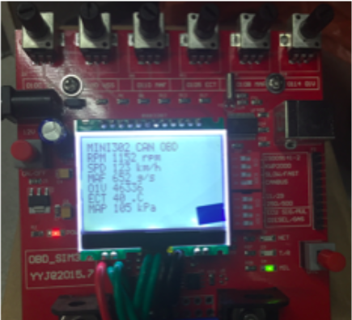
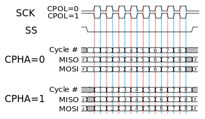
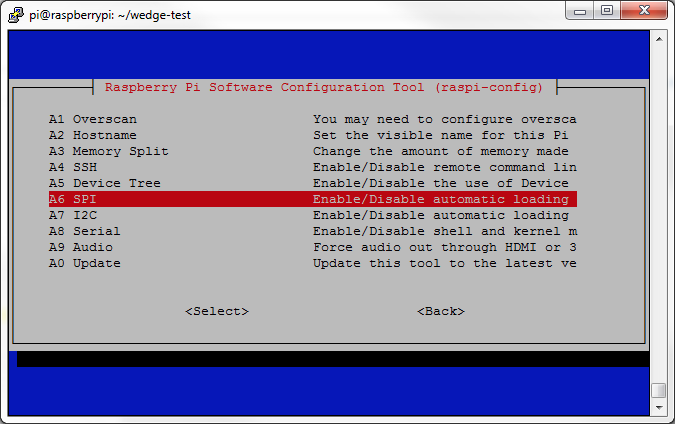
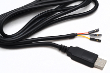
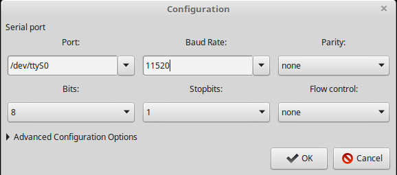

# DIP REPORT

## Index
1. Collect data from _OBD_
	* serial-obd
	
2. Display data 
	* SPI communication
	* Use GIRO to Show Message
	* Invert LED Matrics
	
3. Web server to process OBD data and android data
	* RPI settings
		* Network settings
		* Connect to pc 
			* Remote SSH login without password
			* Connect to PC by serial port
				* *nix
				* Windows
		* Blue tooth setthings
	* Team work building
		* Github
		* Front-End Automation
		    * Node js server
			* Expressjs
			* Gulp
		
4. Reference link


 
### 1. Collect data from _OBD_
---


We use OBD simulator to simulate the engines status and tansfer data from ELM327 microcontroller(the controller for the OBD simulator) to USB.To communicate with ELM327 to computer through serial connection ,we need to set the baud rate to **38400**,**8** data bits,**no parity** bits and **1** stop bit. And we need to use command **ls -l ttyUSB\*** to check the correct mount location.There are two command sets supported by ELM327, one is the PID command set which is used to communicate with a vehicle or the OBD-­‐‑II simulator,(for example, the OBD command‘0100’ requests the informationof availability of PIDs **[01 -­‐‑20] in Mode 1, in which ’01’ indicates Mode 01 and ’00’ means PID 00). 

Another kind of command is the Hayes AT command set which is considered as the internal commands,(for example, AT command‘atz’ resets the ELM327 chip and all setting are returned to their default values.) Because ELM327 is not case-­‐‑sensitiveand will ignore the spacingso the commands ‘AT Z’, ‘atz’, and ‘AtZ’ are the same to an ELM327

The response to OBD command received from ELM327 are hexadecimal digits in pairs. The first 4 bits will repeat the command andthe rest of data is the requested data from OBD. Because of the response echo the command, the mode value in the response would be added with 40 to distinguish with a command. For example, the response to “0100” may be “41 00 BF 9F B9 90’’. The first byte’41’ represent Mode 01 and “00” represent PID 00. The rest 4   bytes in digital bits are a series of 0(not supported) and 1   (supported) to indicate whether the correspond PID is supported.


Mode(hex)   | Description
--- | --- 
01 | Show current data 
02 | Show freeze frame data 
03 | Show stored Diagnostic Trouble Codes
04 | Clear Diagnostic Trouble Codes and stored value
05 | Test results,oxygen sensor monitoring (non CAN only)
06 | Test results,other component/system monitoring (Test results,oxygen sensor monitoring for CAN only)
07 | Show pending Diagnostic Trouble Codes (detected during current or last driving cycle)
08 | Control operation of on-board component/system
09 | Request vehicle information
0A | Permanent Diagnostic Trouble Codes (DTCs)(Cleared DTCs)

Based on top theory we choose  to use [serial-obd] ,a open source nodejs library to communicate.Here is the code block we use to connect to ELM327.

```javascrpt 
this.serial.on('open', function () {
        self.connected = true;

        self.write('ATZ');
        //Turns off echo.
        self.write('ATE0');
        //Turns off extra line feed and carriage return
        self.write('ATL0');
        //This disables spaces in in output, which is faster!
        self.write('ATS0');
        //Turns off headers and checksum to be sent.
        self.write('ATH0');
        //Turn adaptive timing to 2. This is an aggressive learn curve for adjusting the timeout. Will make huge difference on slow systems.
        self.write('ATAT2');
        //Set timeout to 10 * 4 = 40msec, allows +20 queries per second. This is the maximum wait-time. ATAT will decide if it should wait shorter or not.
        self.write('ATST0A');
        //Set the protocol to automatic.
        self.write('ATSP0');

        //Event connected
        self.emit('connected');
});

```

Here is the code to read data from ELM327
```javescript
 this.serial.on('data', function (data) {
        var currentString, arrayOfCommands;
        currentString = self.receivedData + data.toString('utf8'); // making sure it's a utf8 string

        arrayOfCommands = currentString.split('>');

        var forString;
        if (arrayOfCommands.length < 2) {
            self.receivedData = arrayOfCommands[0];
        } else {
            for (var commandNumber = 0; commandNumber < arrayOfCommands.length; commandNumber++) {
                forString = arrayOfCommands[commandNumber];
                if (forString === '') {
                    continue;
                }

                var multipleMessages = forString.split('\r');
                for (var messageNumber = 0; messageNumber < multipleMessages.length; messageNumber++) {
                    var messageString = multipleMessages[messageNumber];
                    if (messageString === '') {
                        continue;
                    }

                    self.emit('debug', 'in    ' + messageString);

                    var reply;
                    reply = parseOBDCommand(messageString);
                    self.emit('dataReceived', reply);

                    if (self.awaitingReply == true) {
                        
                    }
                    self.receivedData = '';
                }
            }
        }
 });
```

### 2. Display data
---
#### 2.1 SPI
Here is our LED matrics design by our groupmates,after the discussion we deside to use raspberry pi as our platform to build our project and after the research form [Raspberry webpage][RPI SPI] 

Then you should enable the SPI communication on the RPI
 
#### 2.2 GPIO pin-outs


-------------
The breakout board has two headers to allow daisy-chaining,
Here is the connection table:

 MAX7219 Output Name  | Remarks    |   RPi Pin |  RPi Function
------ |-------------| --------- |--------------------
VCC  |  +5V Power  |   2     |    5V0
 GND |   Ground      |  6      |   GND
 DIN  |  Data In     |  19      |  GPIO 10 (MOSI)
 CS  |   Chip Select |  24     |   GPIO 8 (SPI CE0)
CLK   | Clock       |  23      |  GPIO 11 (SPI CLK)


```python

```


### 3. Web server to process OBD data and android data
---
#### 3.1 Network settings
This topic we are going to talk about how to setup RPI in NTU,RPI use Linux system but our school wifi(NTUSECURE) is WPA2 Enterprise which inner authentication is MSCHAPv2 powered by microsoft. So we can not connect to our school wifi with just simple click so what we should to is to go to the config folfer ** cd /etc/NetworkManager/system-connections
** and modify the config file ** sudo vim NTUSCURE ** add this line to it and save.Connect to wifi again.

```
[wifi]
hidden=true
mac-address=40:E2:30:0D:6A:CB
mac-address-blacklist=
mac-address-randomization=0
mode=infrastructure
seen-bssids=
ssid=NTUSECURE
system-ca-certs=false

[wifi-security]
group=
key-mgmt=wpa-eap
pairwise=
proto=

[802-1x]
altsubject-matches=
eap=peap;
identity=student\\CXIONG001
password-flags=1
phase2-altsubject-matches=
phase2-auth=mschapv2
```
### 3.2 Connect RPI to PC


##### 3.2.1 Remote login without password


To use Linux and OpenSSH to automate your tasks. Therefore you need an automatic login from host A / user a to Host B / user b. You don't want to enter any passwords, because you want to call ssh from a within a shell script.


First log in on A as user a and generate a pair of authentication keys. Do not enter a passphrase:

```bash
a@A:~> ssh-keygen -t rsa
Generating public/private rsa key pair.
Enter file in which to save the key (/home/a/.ssh/id_rsa): 
Created directory '/home/a/.ssh'.
Enter passphrase (empty for no passphrase): 
Enter same passphrase again: 
Your identification has been saved in /home/a/.ssh/id_rsa.
Your public key has been saved in /home/a/.ssh/id_rsa.pub.
The key fingerprint is:
3e:4f:05:79:3a:9f:96:7c:3b:ad:e9:58:37:bc:37:e4 a@A
Now use ssh to create a directory ~/.ssh as user b on B. (The directory may already exist, which is fine):
```
```bash
a@A:~> ssh b@B mkdir -p .ssh
b@B's password: 
```
Finally append a's new public key to b@B:.ssh/authorized_keys and enter b's password one last time:

```bash
a@A:~> cat .ssh/id_rsa.pub | ssh b@B 'cat >> .ssh/authorized_keys'
b@B's password:
```
From now on you can log into B as b from A as a without password:

```bash
a@A:~> ssh b@B
```

A note from one of our readers: Depending on your version of SSH you might also have to do the following changes:

Put the public key in `.ssh/authorized_keys2`
Change the permissions of `.ssh to 700`
Change the permissions of `.ssh/authorized_keys2 to 640`
##### 3.2.2 Connect to RPI by serial port
Another way to communicate between computer with RPI is connect them by TTL-232R-RPi Debug cable.


Header Pin Number |Name |Type |Colour |Description
-------|------|------|-----|----
1 |GND| GND |Black| Device ground supply pin. Connect to ground pin on RPi board
2 |TXD| Output| Orange| Transmit Asynchronous Data output. Connect to RXD input on RPi board
3 |RXD| Input| Yellow |Receive Asynchronous Data input. Connect to TXD output on RPi board

Then you can simply use gtkterm to make connection. 
```bash
sudo apt-get install gtkterm
gksu gtkterm
```
Remember to set like this:

#### 3.4 Team work building
To do a good job, one must first sharpen one's tools.So we study and use a branch of tool chains to ensure our development smoothly.
##### 3.4.1 Github
GitHub is a web-based Git repository hosting service. It offers all of the distributed version control and source code management (SCM) functionality of Git as well as adding its own features. It provides access control and several collaboration features such as bug tracking, feature requests, task management, and wikis for every project.

So we decide to use Github to manage our project after create account an create a new repository first we need to add our ssh-keygen to github for authentication
```bash
sudo apt-get install git-core
sudo apt-get install xclip
ssh-keygen -t rsa -b 4096 -C "your_email@example.com"
$ xclip -sel clip < ~/.ssh/id_rsa.pub
# Copies the contents of the id_rsa.pub file to your clipboard>
```
Then go to GitHub webpage go to settings and click *Add SSH key* paste here then you can use GitHub to control the version of the project.

Some of the basic git command


Usage | Git command
------- | ---------
CREATE REPOSITORIES | git init [project-name] /  git clone [url]
MAKE CHANGES | git commit -m "[descriptive message]"
REVIEW HISTORY | git log
SYNCHRONIZE UPLOAD | git push[alias][branch]
SYNCHRONIZE DOWNLOAD | git pull

##### 3.4.2 Front-End Automation

Since we use nodejs language to monitoring the OBD we wanna to make our language the same so we choose the Expressjs as the framework to build our webserver.
Here is the code to set up the server at port 5000 to offer static files routing service and dynamic to receive data from RESTFUL get from android and send jsonp back to Front-End.

```javascript

'use strict';

var express = require('express');
var app = express();
var router = express.Router();
app.set("jsonp callback", true);

app.use(express.static('public'));

app.get('/', function(req, res) {
    res.sendfile('./public/index.html');
});

app.get('/data',function (req,res) {
    info=req.query;
    console.log(info);
    res.send('Got it');
});

app.get('/info',function (req,res) {
    //console.log(info);
    info.vss = vss;
    info.rpm=rpm;
    res.jsonp(info);
});
app.listen(5000,function () {
    console.log('Listening on port 5000');
});

```
We also use **gulp** to make auto build and live editing.We use port 4000 as the proxy to forward the http request and monitoring the static files.Automatic refresh the browser when static file changed.
By the way, we use **gulp-nodemon** to live editing the back-end files (app.js).

```javescript

'use strict';

var gulp = require('gulp');
var browserSync = require('browser-sync');
var nodemon = require('gulp-nodemon');

// connected to browser-sync after restarting nodemon
var BROWSER_SYNC_RELOAD_DELAY = 5;

gulp.task('nodemon', function (cb) {
    var called = false;
    return nodemon({

        // nodemon our expressjs server script: 'app.js',
        // watch core server file(s) that require server restart on change
        watch: ['app.js']
    })
        .on('start', function onStart() {
            // ensure start only got called once
            if (!called) { cb();  }
            called = true;
        })
        .on('restart', function onRestart() {
            // reload connected browsers after a slight delay
            setTimeout(function reload() {
                browserSync.reload({
                    stream: false
                });
            }, BROWSER_SYNC_RELOAD_DELAY);
        }); });gulp.task('browser-sync', ['nodemon'], function () {

    // for more browser-sync config options: http://www.browsersync.io/docs/options/
    browserSync({

        // informs browser-sync to proxy our expressjs app which would run at the following location
        proxy: 'http://localhost:5000',

        // informs browser-sync to use the following port for the proxied app
        // notice that the default port is 3000, which would clash with our expressjs
        port: 4000,

        // open the proxied app in chrome
        browser: ['google-chrome']
    });
});

gulp.task('js',  function () {
    return gulp.src('public/**/*.js')
    //.pipe(uglify())
    //.pipe(gulp.dest('...'));
});

gulp.task('css', function () {
    return gulp.src('public/**/*.css')
        .pipe(browserSync.reload({ stream: true  }));
})

gulp.task('bs-reload', function () {
    browserSync.reload();
});

gulp.task('default', ['browser-sync'], function () {
    gulp.watch('public/**/*.js',   ['js', browserSync.reload]);
    gulp.watch('public/**/*.css',  ['css']);
    gulp.watch('public/**/*.html', ['bs-reload']);

});

```

### Reference
---
https://github.com/EricSmekens/node-serial-obd
https://www.raspberrypi.org/documentation/hardware/raspberrypi/spi/README.md
http://hackaday.com/2013/01/06/hardware-spi-with-python-on-a-raspberry-pi/
http://gammon.com.au/forum/?id=11516
http://louisthiery.com/spi-python-hardware-spi-for-raspi/
http://www.brianhensley.net/2012/07/getting-spi-working-on-raspberry-pi.html
http://raspi.tv/2013/8-x-8-led-array-driven-by-max7219-on-the-raspberry-pi-via-python
http://quick2wire.com/non-root-access-to-spi-on-the-pi

[serial-obd]:https://github.com/EricSmekens/node-serial-obd

[RPI SPI]:https://www.raspberrypi.org/documentation/hardware/raspberrypi/spi/README.md
