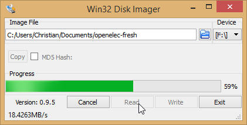
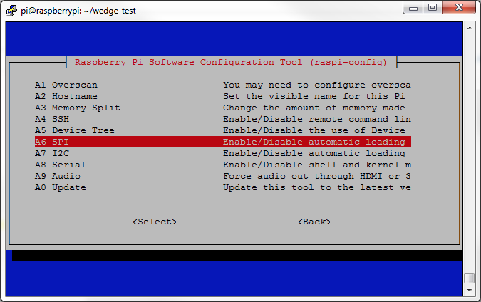

#Install RPI system && Our project


**Overall Setup:**

1. Install Raspbian OS
   Firstly you should download the image of the raspbian OS from [Raspberry webpage][RPI]
   If you use windows system you should download **Win32 Disk Imager** to burn the image into the SD card.
   

2. Connect RPI to monitor via HDMI cable and enable all ports and interfaces

You should enable the interface of the RPI 
```bash
sudo raspi-config
```
you will see the settings in blew remember to open Serial and SPI interface for this project.
 
---
####  Network settings
Since you need to connect wifi in NTU ,RPI use Linux system but our school wifi(NTUSECURE) is WPA2 Enterprise which inner authentication is MSCHAPv2 powered by microsoft. So we can not connect to our school wifi with just simple click so what we should to is to go to the config folfer ** cd /etc/NetworkManager/system-connections** and modify the config file ** sudo vim NTUSCURE ** add this line to it and save.Connect to wifi again.

```
[wifi]
hidden=true
mac-address=40:E2:30:0D:6A:CB
mac-address-blacklist=
mac-address-randomization=0
mode=infrastructure
seen-bssids=
ssid=NTUSECURE
system-ca-certs=false

[wifi-security]
group=
key-mgmt=wpa-eap
pairwise=
proto=

[802-1x]
altsubject-matches=
eap=peap;
identity=student\\CXIONG001
password-flags=1
phase2-altsubject-matches=
phase2-auth=mschapv2
```

3. Use Putty.exe(serial speed: 115200) and connect RPI to Windows via USB-TTL serialcable(Optional)

USB-TTL serial cable PIN configuration:

Red-VCC  BLACK-GND  WHITE-TX  GREEN-RX 

 

 

**RPI Environment Setup for OBD-LED Matrix(python): **[https://github.com/Pbartek/pyobd-pi](https://github.com/Pbartek/pyobd-pi)

 

**RPI Environment Setup for OBD-Webserver(nodejs):**


1.  Install NodeJs via NPM: 


```bash
curl -sL https://deb.nodesource.com/setup_7.x | sudo -E bash –
```

```bash
sudo apt-get install -y nodejs
```

2. Install npm serialport

```bash
sudo npm install serialport --unsafe-perm --build-from-source
```

 

 

**Download source code from github: **

git clone [https://github.com/xiongchenyu6/Dip_Project_for_OBD.git](https://github.com/xiongchenyu6/Dip_Project_for_OBD.git)

 

**Max7219 Config: **
```bash
cd Dip_Project_for_OBD/

cd max7219/

sudo python setup.py install
```


**Webserver Config:**
```bash
cd~

cd Dip_Project_for_OBD/

cd mapServer/

npm install
```


**Gulp Config:**
```bash
sudo npm install --global gulp-cli
```


To start the webserver, enter(within “mapserver” folder): gulp

To start the LED Matrix, run “Dip_Project_for_OBD/pyobd-pi/obd_recorder.py”


[RPI]:https://www.raspberrypi.org/downloads/raspbian/